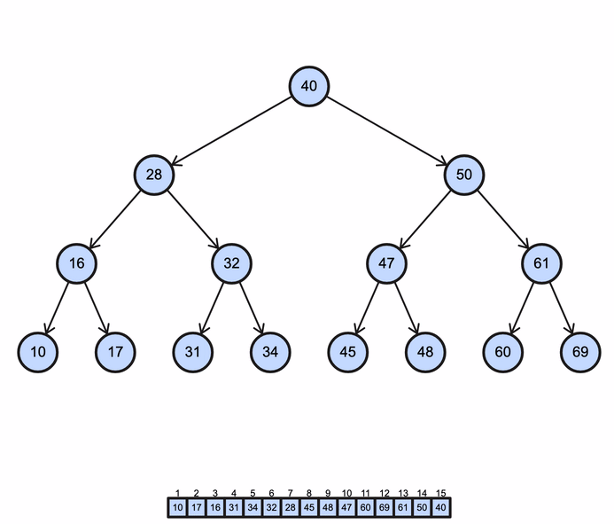

# BINARY TREES

---

## What is a Binary Tree?

A binary tree is a data structure that ressembles the branches of a tree. In a binary tree each parent node can have up to two child nodes. (See node reference example below) This is why it's called a binary tree. Bi is a prefix meaning two Ex. bicycle, biplane, bipolar, etc. There are two subtrees that can come from any one node.

Binary trees typically use a similar hashing function as what was previously explained in the set tutorial. The values are then sorted into the binary tree based on hash values. This is especially true for more complex element values such as strings.

For our purposes we will use simple integers to highlight and more deeply understand the structure of binary trees. You will see this in the example and problem to solve code.
Below is an illustration showing the structure of a basic binary tree.

Notice: The Root Node = 8, Its Subtrees starting with 3 and 10, A Parent Node = 3, Its Child Nodes = 1 and 6.
Understanding these terms will help when discussing aspects of binary trees.

## What advantages does a Binary Tree offer?

Binary trees can perform rapid, effecient operations on data much like a set. The big O notation for the effeciency of finding a value in a binary tree is O(log2n). This is far faster than trying to find a value in an unsorted array which would be O(n), especially as the number of elements (n) increases.

In the example you'll see a simple binary tree based on integer values. In instances like this you can think of the values in the binary tree as ordered, because you can traverse from the least value to the highest (left-most depth first traverse pattern). This ordering of elements in a binary tree structure can be beneficial.

The binary tree is a common data structure with a well known paradigm of recusive traversing. This is an advantage because there are many resources available to use as a reference while programming with binary trees.

## Example

To solve the problem for this tutorial you will need to understand the basics of recursion.

Recursion is a paradigm of problem solving. It is all about reducing a problem to its base solution through recurring fuction calls. This is different from iterative solutions that traverse with a known loop structure, like counting. A recursive solution can have remarkable levels of complexity, and yet be written in a way that is simple and elegant. This is illustrated in the way it traverses a binary tree.

To traverse a binary tree using recursion you:

1. Define the base case, in this instance it is when the there is no longer any further nodes to evaluate. This case returns out of the recursive function.

2. Define the case that leads to the base case and decomposes or breaks down the complex problem to a more simple one each time. This case then calls the function again, but with new information making it one step closer to the base case. (The function calling itself is what makes this a recursive solution)

3. Call the recursive function initially with the necessary parameters.

Here is an animation illustrating one way to traverse a binary tree.

[Binary Trees Example](example_code/binary_trees_example.py)

## Problem to Solve

Complete the recursive function to build a binary tree given an array of ordered integers from least to greatest.

[Binary Trees Problem](problem_code/binary_trees_problem.py)
