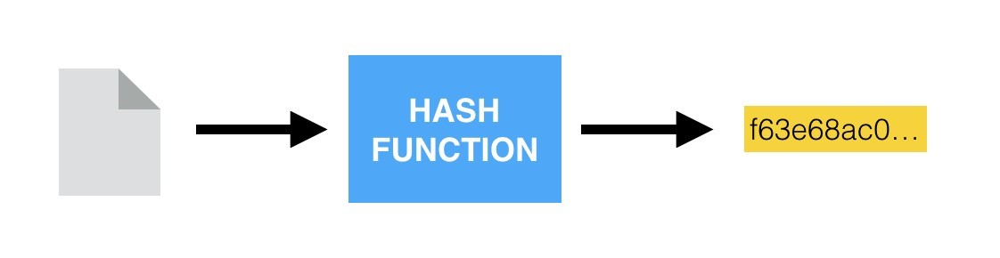
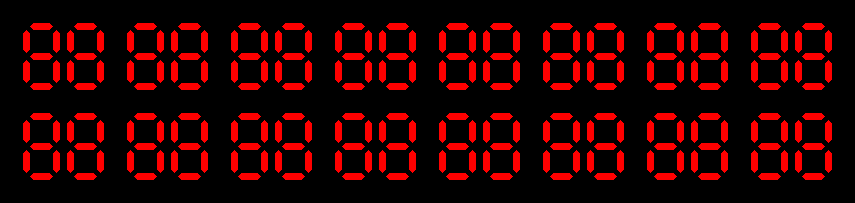

# SETS

---

## What is a Set?

Sets are a collection of unordered, unique elements Ex. (2, 1, 3, 4).
Sets offer O(1) lookups, insertions, and deletions. This is a remarkable effeciency improvement when comparing these same operations performed on an ordered list. The engine that allows for this power is a method called hashing.

Hashing is all about storing data with a unique value to a location/id that is representative of this value.

What does this mean? Let me illustrate with an example. I have a string value I wish to store; let's say the string value is "I like pie". Now to the computer this string value might correspond with a series of unicode characters that have values (0049, 0020, 006C, 0069, 006B, 0065, 0020, 0070, 0069, 0065). This shows us that the computer can treat all hashable variables the same. To the computer it is simply another set of values.

These values can then have a hashing function performed on them. That is to say, the computer will perform a mathmatical function on our string value to make a unique hash value from it.

This hash value is what allows such efficient lookups, because the value we're looking for directly corresponds through the hash function with the element in the set that we're trying to find it. When multiple hashes are used to store values (like in a set) they are often referred to as a hash map.

This is why by definition sets do not allow duplicates. You can't have two hash values that are the exact same, but correspond to different elements of the same value.

Below is an gif displaying its own hash value. When you understand that hash values have to be unique identifiers, you can better understand their benefits and requirements.

Why is it unordered? A set does not maintain a specific order unlike stacks, arrays, etc. This is due to the previously mentioned function of hashing elements of a set.

The computer stores elements according to its function, and we don't really care to get involved in the details because we would just slow it down, so instead we simply abstract that away. If you log a set of values to the console, you'll often find they show up in different orders each time. Like I said before, we don't really care. We give up ordering of elements to allow for effeciency increases in lookups, insertions, and deletions. If you wanted the elements your storing to be ordered, it would be more advantageous to use a data structure like an array, stack, or queue.

## What advantages does a Set offer?

As stated before, the main advantage a set offers is increased effeciency. It has a big O notation of O(1) for: searching for a value in the set (lookups), adding a value to the set (insertions), and removing a value from the set (deletions).

Another benefit of a set is its inherent duplicate removal. There can't be two of the same value in a set. This can be particularly advantageous for cases when you only want unique values, for instance IDs. You wouldn't want two individuals to have the same identification number, it would cause all sorts of errors. The set can prevent duplicates from ever existing, just make sure you're using it properly to solve problems it is optimized to solve.

## Example

## Problem to Solve
